# bb4-simulations

[](https://github.com/bb4/bb4-simulations/actions/workflows/ci.yml)

Interactive Scala/Swing simulations of physical, mathematical, and procedural systems — reaction–diffusion chemistry, Mandelbrot navigation, fluid flow, Conway’s Game of Life, spring-based snakes, stock trading strategies, wave-function collapse, and more. Each app shares a common simulator framework so you can tweak parameters and watch the system evolve in real time.

## Screenshots

<table>
  <tr>
    <td align="center"><a href="docs/screenshots/reactiondiffusion.jpg">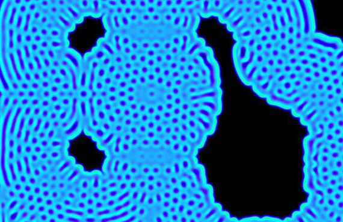</a><br/>Reaction Diffusion</td>
    <td align="center"><a href="docs/screenshots/henonexplorer.jpg">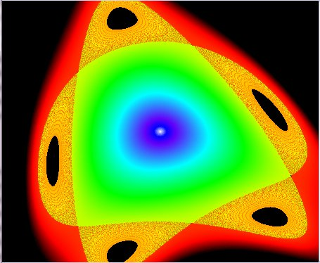</a><br/>Henon Phase</td>
    <td align="center"><a href="docs/screenshots/fractalexplorer.jpg">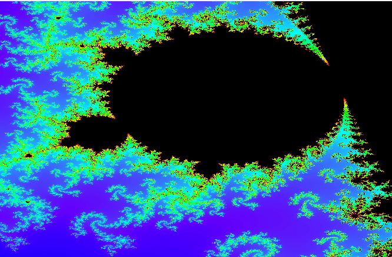</a><br/>Fractal Explorer</td>
    <td align="center"><a href="docs/screenshots/cave.jpg">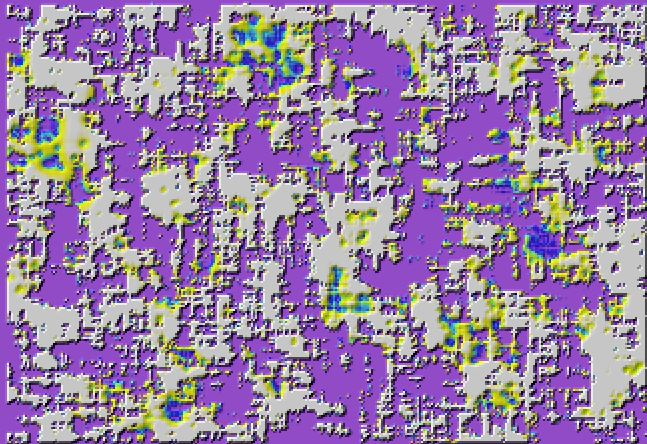</a><br/>Cave Explorer</td>
  </tr>
  <tr>
    <td align="center"><a href="docs/screenshots/dungeon.png">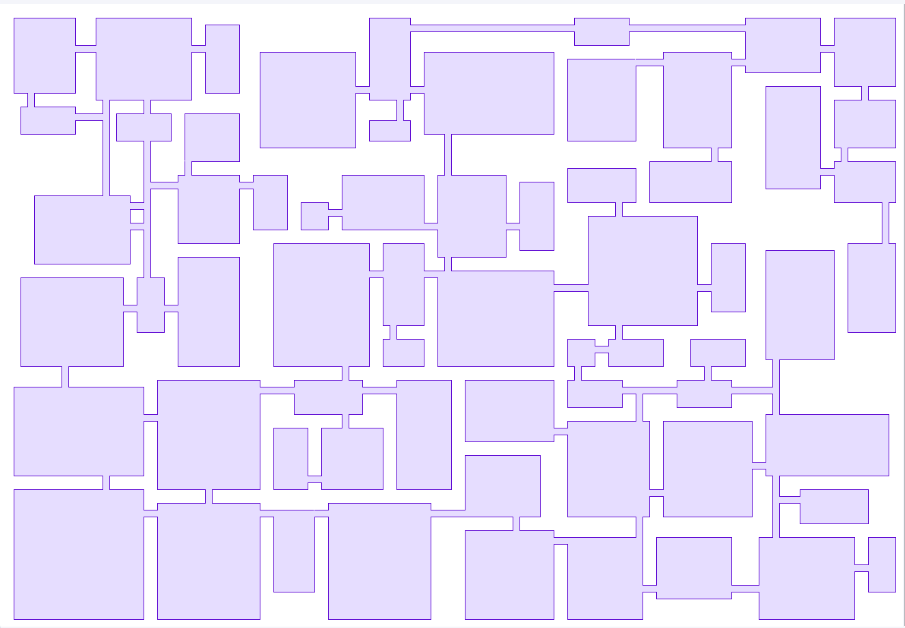</a><br/>Dungeon Generator</td>
    <td align="center"><a href="docs/screenshots/conway.jpg">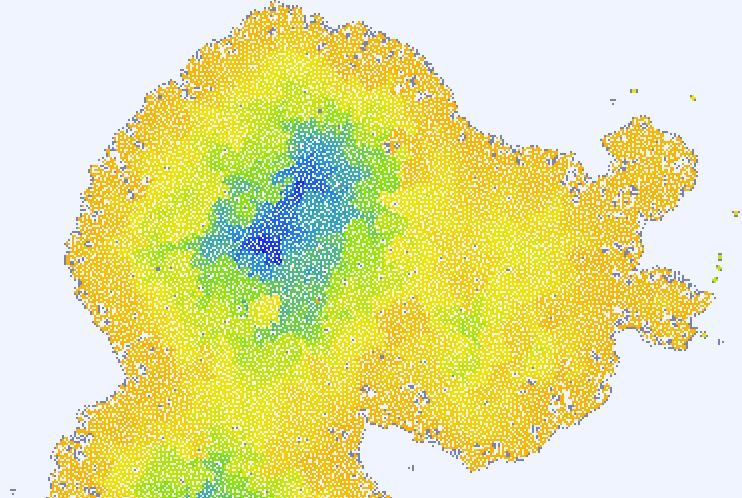</a><br/>Conway's Life</td>
    <td align="center"><a href="docs/screenshots/snake.jpg">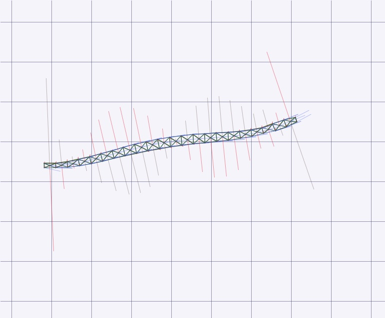</a><br/>Snake</td>
    <td align="center"><a href="docs/screenshots/dice.jpg">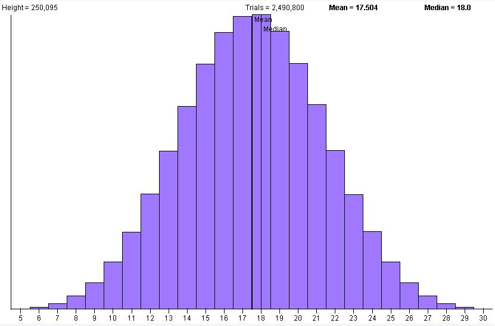</a><br/>Dice</td>
  </tr>
  <tr>
    <td align="center"><a href="docs/screenshots/stock.jpg">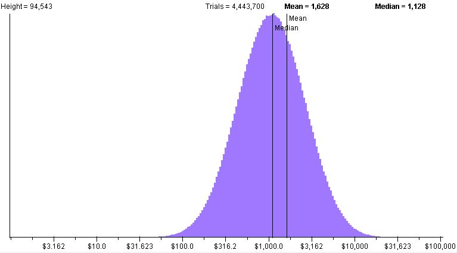</a><br/>Stock Price</td>
    <td align="center"><a href="docs/screenshots/trading.jpg">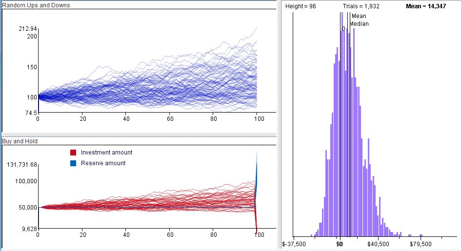</a><br/>Stock Trading</td>
    <td align="center"><a href="docs/screenshots/habitat.jpg">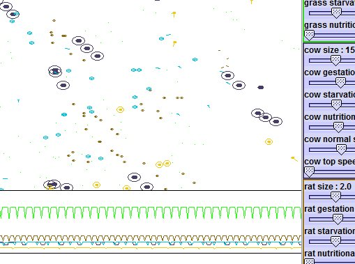</a><br/>Habitat</td>
    <td align="center"><a href="docs/screenshots/verhulst.jpg">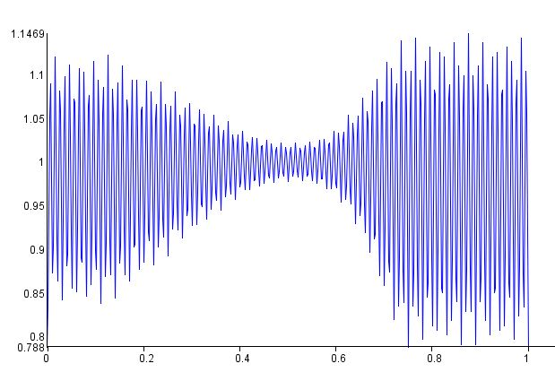</a><br/>Verhulst</td>
  </tr>
  <tr>
    <td align="center"><a href="docs/screenshots/voronoi.png">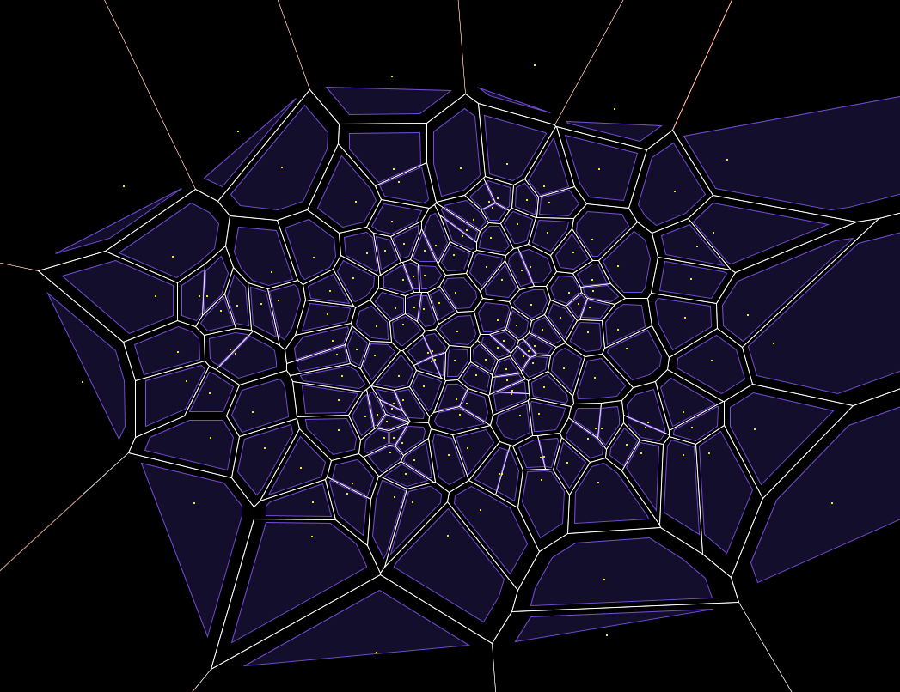</a><br/>Voronoi Explorer</td>
    <td align="center"><a href="docs/screenshots/predprey.jpg">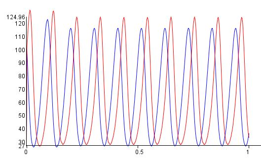</a><br/>Predator Prey</td>
    <td align="center"><a href="docs/screenshots/fluid.jpg">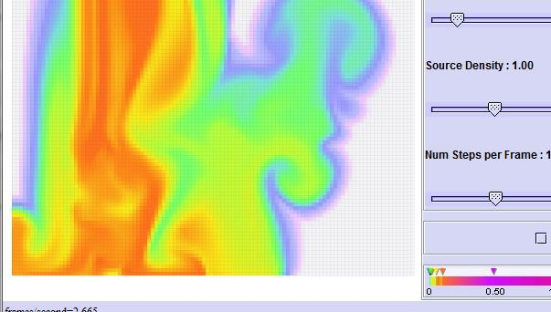</a><br/>Fluid</td>
    <td align="center"><a href="docs/screenshots/liquid.jpg">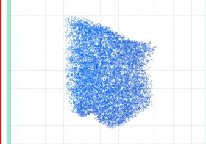</a><br/>Liquid</td>
  </tr>
  <tr>
    <td align="center"><a href="docs/screenshots/water.jpg">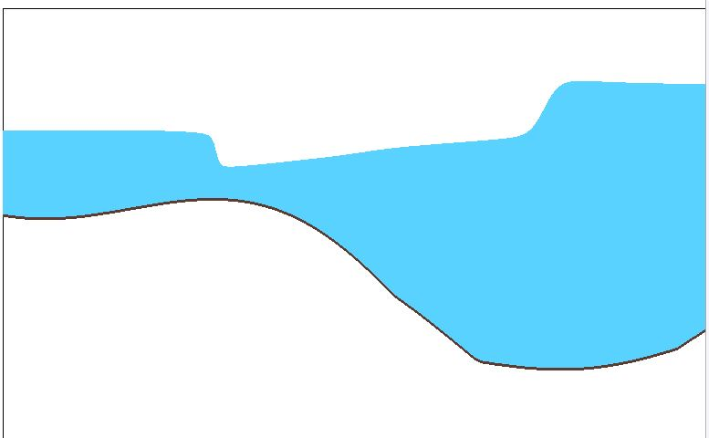</a><br/>Water</td>
    <td align="center"><a href="docs/screenshots/trebuchet.jpg">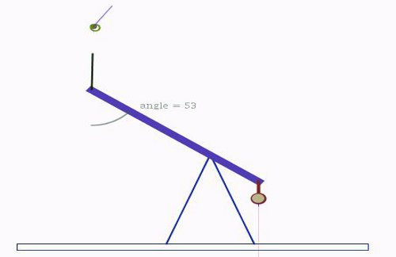</a><br/>Trebuchet</td>
    <td align="center"><a href="docs/screenshots/spirograph.jpg">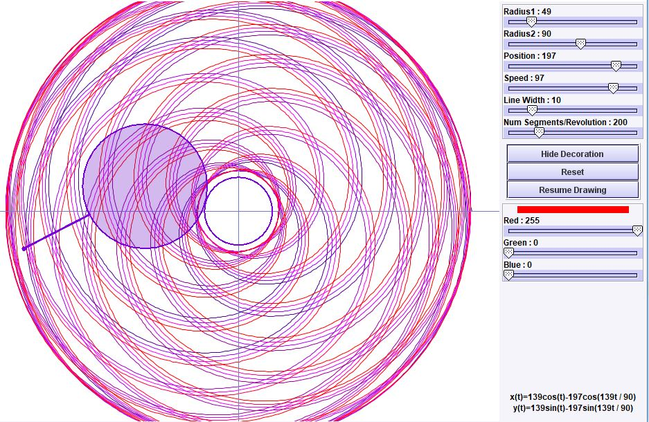</a><br/>Spirograph</td>
    <td align="center"><a href="docs/screenshots/sierpinski.jpg">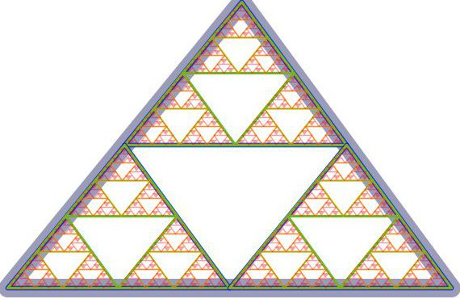</a><br/>Sierpinski</td>
  </tr>
  <tr>
    <td align="center"><a href="docs/screenshots/lsystem.jpg">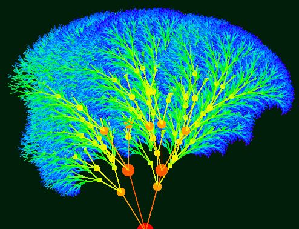</a><br/>L-System Tree</td>
    <td align="center"><a href="docs/screenshots/waveFunctionCollapse.png">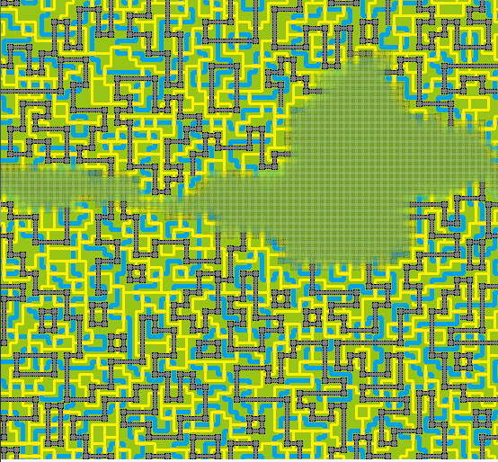</a><br/>Wave Function Collapse</td>
  </tr>
</table>

Click a thumbnail to open the full-size image.

## Simulations

| Simulation | Gradle task | Description |
|------------|-------------|-------------|
| [Reaction Diffusion](docs/screenshots/reactiondiffusion.jpg) | `runReactiondiffusion` | Two-chemical reaction–diffusion patterns (Gray–Scott style). |
| [Henon Phase Explorer](docs/screenshots/henonexplorer.jpg) | `runHenonexplorer` | Explore parameters of the Hénon strange attractor. |
| [Fractal Explorer](docs/screenshots/fractalexplorer.jpg) | `runFractalexplorer` | Zoom the Mandelbrot set; drag to zoom, undo with go-back. |
| [Cave Explorer](docs/screenshots/cave.jpg) | `runCave` | Generate cave maps with cellular automata. |
| [Dungeon Generator](docs/screenshots/dungeon.png) | `runDungeon` | Procedurally generate dungeon levels. |
| [Conway’s Game of Life](docs/screenshots/conway.jpg) | `runConway` | Cellular automaton with alternate rule sets; color shows age. |
| [Snake](docs/screenshots/snake.jpg) | `runSnake` | Spring-based snake locomotion (Gavin Miller, SIGGRAPH 1988). |
| [Dice](docs/screenshots/dice.jpg) | `runDice` | Histogram of rolling N dice with M sides. |
| [Stock Price](docs/screenshots/stock.jpg) | `runStock` | Expected outcomes for volatile stocks over many periods. |
| [Stock Trading](docs/screenshots/trading.jpg) | `runTrading` | Compare trading strategies on simulated price paths. |
| [Habitat](docs/screenshots/habitat.jpg) | `runHabitat` | Multi-creature habitat with predator/prey dynamics. |
| [Verhulst Population](docs/screenshots/verhulst.jpg) | `runVerhulst` | Discrete logistic (Verhulst) population growth / chaos. |
| [Voronoi Explorer](docs/screenshots/voronoi.png) | `runVoronoi` | Poisson-disc sampling and Voronoi diagrams. |
| [Predator Prey](docs/screenshots/predprey.jpg) | `runPredprey` | Fox and rabbit population curves over time. |
| [Fluid](docs/screenshots/fluid.jpg) | `runFluid` | Deep-water fluid dynamics (Jos Stam); drag to stir. |
| [Liquid](docs/screenshots/liquid.jpg) | `runLiquid` | Particle-based liquid simulation (Foster et al.). |
| [Water](docs/screenshots/water.jpg) | `runWater` | 2D deep-water waves (Kass & Miller); drag to reshape. |
| [Trebuchet](docs/screenshots/trebuchet.jpg) | `runTrebuchet` | Physically based trebuchet with tunable parameters. |
| [Spirograph](docs/screenshots/spirograph.jpg) | `runSpirograph` | Parametric spirograph curves. |
| [Sierpinski Triangle](docs/screenshots/sierpinski.jpg) | `runSierpinski` | Classic self-similar triangular fractal. |
| [L-System Tree](docs/screenshots/lsystem.jpg) | `runLsystem` | Fractal trees from L-system expressions. |
| [Wave Function Collapse](docs/screenshots/waveFunctionCollapse.png) | `runWaveFunctionCollapse` | Procedural scenes from seed images or tile sets. |

Developer / demo apps (not packaged as installers): `runGraphing`, `runFuncinverse`, `runParameter`, `runComplexmapping`.

## Running it

**Option 1 — installer (recommended):** download the installer for your OS from the
[latest release](https://github.com/bb4/bb4-simulations/releases/latest)
(macOS `.dmg`, Windows `.msi`, Linux `.deb` — one installer per simulation).

**Option 2 — from source:**

```bash
git clone https://github.com/bb4/bb4-simulations.git
cd bb4-simulations
./gradlew runReactiondiffusion   # or runSnake, runFractalexplorer, runFluid, …
./gradlew tasks --group application   # list all runnable simulations
```

The default `./gradlew run` launches the Dice simulator. Most apps share the `SimulatorApp` entry point with a `-panel_class` argument; Gradle creates a `run<App>` task for each entry in `appMap`.

## Using it as a library

Published artifact (latest release **2.1**):

```groovy
implementation 'com.barrybecker4:bb4-simulation:2.1'
```

See the [releases page](https://github.com/bb4/bb4-simulations/releases) if you need a different version.

## What's inside

- **`com.barrybecker4.simulation.common`** — shared Swing simulator framework (`Simulator`, `SimulatorApp`, options dialogs, animation hooks)
- **Per-simulation packages** under `com.barrybecker4.simulation.*` — model and UI for each app in the table above (e.g. `reactiondiffusion`, `fractalexplorer`, `snake`, `fluid`, `waveFunctionCollapse`)
- **Standalone launchers** — `Spirograph` and `SierpinskiApplet` also ship as their own start scripts (`bb4-spirograph`, `bb4-sierpinski`)

## Building from source

See the [Building bb4 Projects wiki](https://github.com/bb4/bb4-common/wiki/Building-bb4-Projects).

## License

MIT — see [LICENSE](LICENSE).
