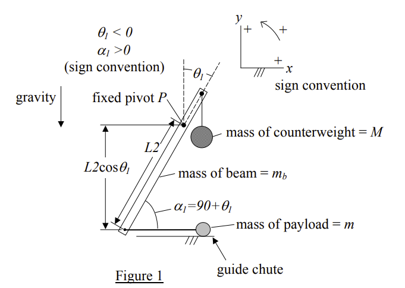
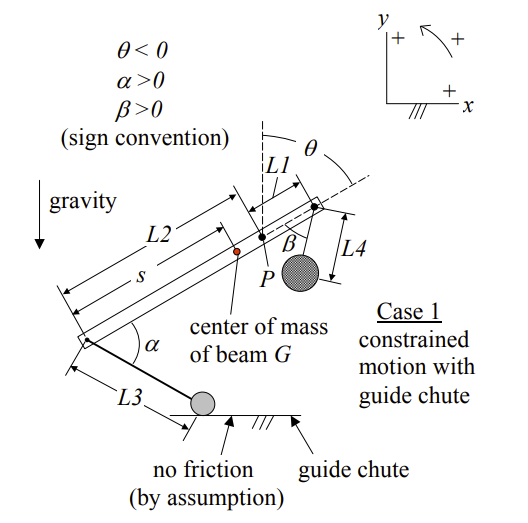

# Calculation Notes

See [trebuchet physics](https://www.real-world-physics-problems.com/trebuchet-physics.html). 

Optimal configuration based on his definition of "range efficiency" is such that:

- The initial release position is when the beam on the counterweight side makes an angle of 45° with the vertical. 
- The length of the long arm of the beam (on the payload side) is 3.75 times the length of the short arm of the beam (on the counterweight side). 
- The length of the sling is equal to the length of the long arm of the beam (on the payload side).
- The counterweight has a mass 100x the payload (but it can be less and still get good results).

The variables are:
- counterWeightMass  (M)
- projectileMass   (m, mass of payload)
- leverAngle (theta, where theta < 0)
- slingAngle (alpha, where alpha > 0 and alpha = theta + 90)
- counterWeightLeverArmLength = L1
- slingLevelArmLength = L2
- leverLength = L1 + L2
- leverArmRatio  (ratio of sling arm to counterWeight arm)
- slingLength (L3)
- counterWeightCableLength = L4 (should equal L1)
- s - distance between payload end of beam and center of mass of the beam (G)
- theta - angle between the vertical and the beam on the counterweight side. Always negative.
- alpha - angle between the beam and the cable holding the payload. Always positive.
- beta - angle between the beam and the counterweight cable. Always positive.
- T - tension on the cable holding the payload
- T2 - tension on the cable holding the counterweight
- mb - mass of the beam
- g - gravity. 9.8 m/s^2

